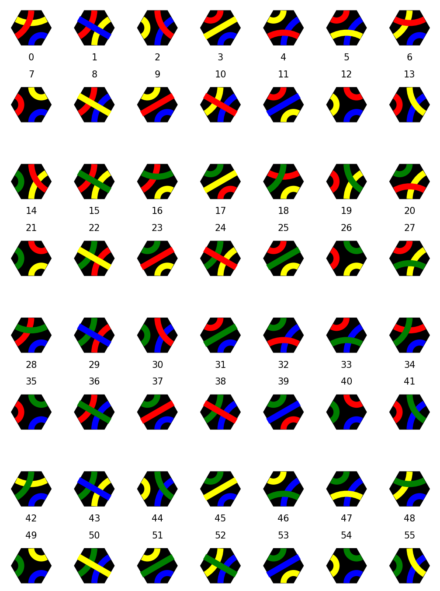
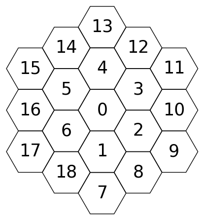
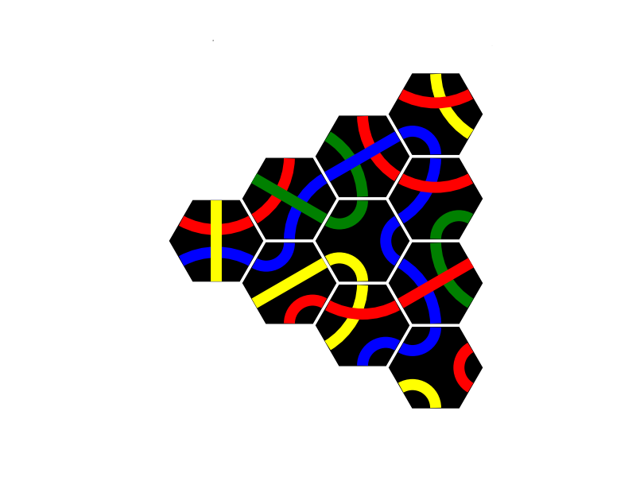

# Tantrix Puzzle Solver with Simulated Annealing

## Overview

This project involves solving [Tantrix](https://tantrix.com) puzzles using a simulated annealing algorithm. Tantrix is a tile-based game that requires arranging hexagonal tiles in a specific way to match colored edges. The goal of this project is to use simulated annealing to find optimal or near-optimal solutions for given Tantrix puzzles.

It can be used together with [this](https://github.com/LE-428/TantrixGUI) project, which creates a simple GUI application to play Tantrix puzzles.

## Files

- **start.py**: Quick-start file that can be executed directly from the command window with `python start.py`, add `-h` for help
- **main.py**: Contains the primary functions and implementations for solving the Tantrix puzzle using simulated annealing.
- **main_parallel.py**: Implements parallel processing to enhance the performance of the puzzle-solving algorithm, leveraging multiple CPU cores.
- **landscape.py**: Analyzes the fitness landscape of the Tantrix flower puzzle
- **equivalence.py**: Groups the puzzles by using symmetry and color permutations

## Data

- **solutions.txt**: One solution of every puzzle per line (3432)
- **3432.txt**: Number of solutions to the 3432 flower puzzles with 3 colors
- **sols_135135_pairings.csv**: Number of solutions combined to the 128 puzzles emerging from every pairing of the first 14 Tantrix tiles (see `calc_sols_per_pairing` in **main.py**)
- **equivalence_classes.csv**: (see `write_class_data` in **main.py**)
- **0-3432**: Folders with all solutions to the 3432 Puzzles, use `draw_sol` in **main.py** to draw
## Simulated Annealing Algorithm

Simulated annealing is a probabilistic technique for approximating the global optimum of a given function. In the context of the Tantrix puzzle, the algorithm attempts to minimize the number of mismatched edges between adjacent tiles.

## Tantrix Tiles

**The 56 Tantrix tiles, grouped into 4 sets of 3 colors, with their corresponding numbers**

**Visualization of the enumeration of the board fields, ascending counter-clockwise per 'ring' around the center**

**Example puzzle with representation**

- [16, 6, 5, 1, 0, 4, 8, 2, 3, 12] (fields)
- [8, 3, 36, 6, 54, 29, 7, 38, 32, 0] (tiles)
- ['121323', '112332', '141343', '113232', '114422', '313414', '112233', '131434', '131443', '112323'] (tile codes: (1: blue, 2: yellow, 3: red, 4: green), visiting the hexagon edges counter-clockwise)
- [1, 3, 0, 0, 5, 5, 3, 2, 3, 1] (tile orientation: orientation 0 is as seen in the image with the 56 tiles above, rotating a tile by 60 degrees clockwise increases the orientation by 1)

Combined representation:
- [[fields], [tiles], [tile codes], [orientations]],
- [[fields], [tiles], [orientations]] or
- [[tiles], [tile codes], [orientations]] if fields = [0, 1, 2, 3, 4, 5, 6] ('flower-puzzle', see [Tantrix Shake](https://www.quecke-verlag.de/wp-content/uploads/2021/03/spielanleitung-shake.pdf)), use `draw_sol` to generate images of solutions

---